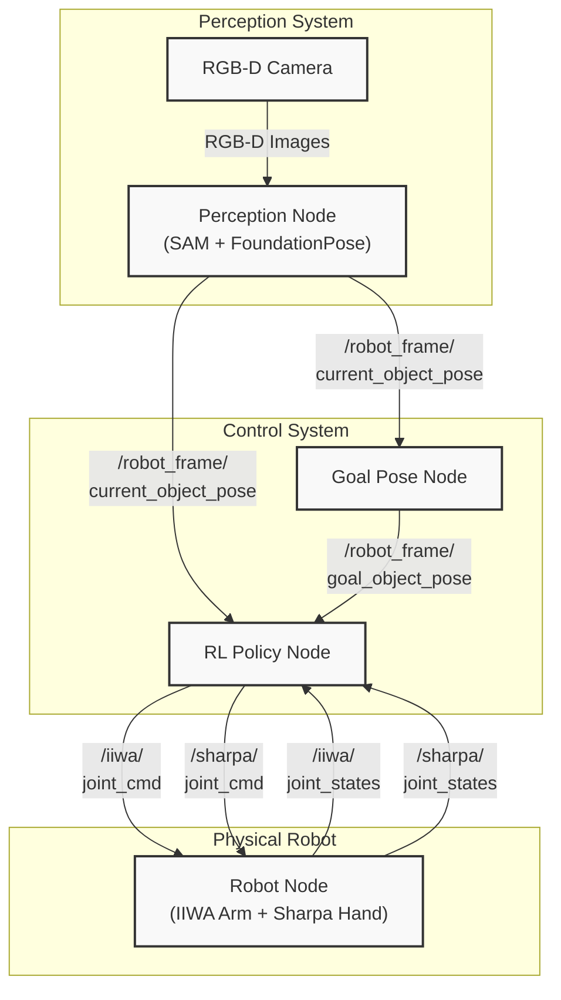
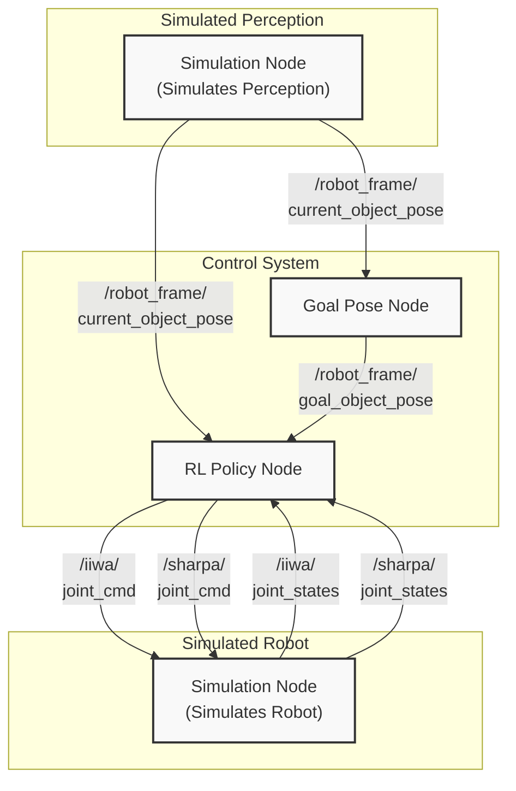
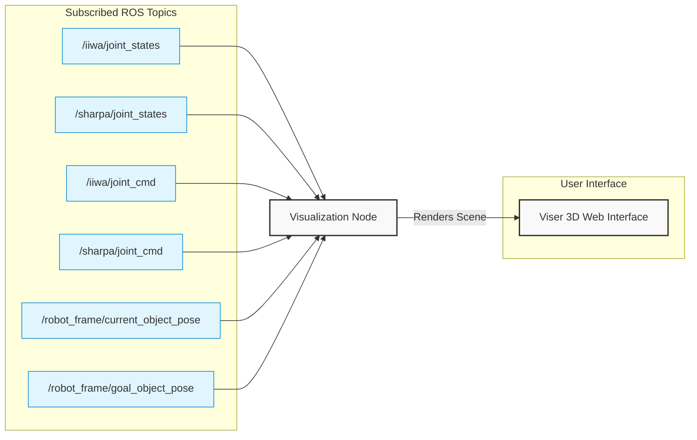

# SimToolReal: An Object-Centric Policy for Zero-Shot Dexterous Tool Manipulation

[Project Page](https://simtoolreal.github.io/)

https://github.com/user-attachments/assets/e2d0db98-2e31-46aa-9480-c4c6f4a48f7d

# Overview

This repository contains the official implementation of the SimToolReal framework, which was introduced in _SimToolReal: An Object-Centric Policy for Zero-Shot Dexterous Tool Manipulation_. It consists of:

* Simulation Environments: Isaac Gym environments for training and evaluation of dexterous tool manipulation policies.

* DexToolBench: A benchmark for dexterous tool manipulation.

* Reinforcement Learning (RL) Training: RL training algorithms for training dexterous tool manipulation policies.

* Deployment: Policy deployment in simulation and the real world.

# Project Structure

```
simtoolreal
  ├── assets
  │   └── // Assets such as robot URDF files, object models, etc.
  ├── baselines
  │   └── // Implementation of kinematic retargeting and fixed grasp
  ├── deployment
  │   └── // Sim-to-real and sim-to-sim deployment of the policy
  ├── dextoolbench
  │   ├── data
  │   │   └── // DexToolBench data (needs to be downloaded)
  │   ├── // Scripts for evaluating policies on DexToolBench
  │   └── // Scripts for visualizing DexToolBench objects and trajectories
  ├── docs
  │   └── // Documentation
  ├── isaacgymenvs
  │   └── // Simulation environment for training and evaluating policies
  ├── pretrained_policy
  │   └── // Checkpoint of the pretrained policy (needs to be downloaded)
  ├── recorded_data
  │   └── // Interface and tools for saving, loading, and visualizing recorded data
  └── rl_games
      └── // RL algorithms, including PPO and SAPG

```

**External repos:**
[FoundationPose](https://github.com/kushal2000/FoundationPose) — Perception system (SAM + FoundationPose pose tracking)

# Installation

Please see the [Installation](docs/installation.md) documentation for more details.

# Quick Start

Please run all commands from the root directory of this repository.For most commands, you can add `--help` to see the available options.

## Interactive Evaluation of a Pretrained Policy on DexToolBench

### Download Pretrained Policy

First, download the pretrained policy to `pretrained_policy/`.

```
python download_pretrained_policy.py
```

This will result in the following directory structure:

```
pretrained_policy/
  ├── config.yaml  // Configuration file for the policy
  └── model.pth  // Checkpoint of the policy
```

### Run Interactive Evaluation

Then, run the interactive evaluation script with the pretrained policy:

```
python dextoolbench/eval_interactive.py \
--config-path pretrained_policy/config.yaml \
--checkpoint-path pretrained_policy/model.pth
```

This launches a web-based interactive demo (default at `http://localhost:8080`) where you can select the tool category, object instance, and task from dropdown menus, then load the environment and run episodes. You can optionally specify a custom port with `--port` for the viser server.

https://github.com/user-attachments/assets/58eb188b-662c-4190-8148-29710c9eb20f


The following is the full DexToolBench data structure:
```
# ── Full DexToolBench data structure ──────────────────────────────────────────
# {object_category: {object_name: [task_name, ...]}}
DEXTOOLBENCH_DATA_STRUCTURE: Dict[str, Dict[str, List[str]]] = {
    "hammer": {
        "claw_hammer": ["swing_down", "swing_side"],
        "mallet_hammer": ["swing_down", "swing_side"],
    },
    "marker": {
        "sharpie_marker": ["draw_smile", "write_c"],
        "staples_marker": ["draw_smile", "write_c"],
    },
    "eraser": {
        "flat_eraser": ["wipe_smile", "wipe_c"],
        "handle_eraser": ["wipe_smile", "wipe_c"],
    },
    "brush": {
        "blue_brush": ["sweep_forward", "sweep_right"],
        "red_brush": ["sweep_forward", "sweep_right"],
    },
    "spatula": {
        "flat_spatula": ["serve_plate", "flip_over"],
        "spoon_spatula": ["serve_plate", "flip_over"],
    },
    "screwdriver": {
        "long_screwdriver": ["spin_vertical", "spin_horizontal"],
        "short_screwdriver": ["spin_vertical", "spin_horizontal"],
    },
}
```

See `dextoolbench/objects.py` and `assets/urdf/dextoolbench/<object_category>/<object_name>/<object_name>.urdf` for more details about the objects. 

See `dextoolbench/trajectories` for the list of task names following the directory structure `dextoolbench/trajectories/<object_category>/<object_name>/<task_name>.json`, which is the output of `dextoolbench/process_poses.py`. These `.json` files are poses specified in world frame.

## Policy Learning in Simulation

### WandB Setup

Training logs are tracked with [Weights & Biases](https://wandb.ai/). Before training, log in and update the `wandb_entity` in `isaacgymenvs/launch_training.py` to your own WandB entity:

```
wandb login
```

### Training a New Policy

To train a policy from scratch, run the following command:

```
python isaacgymenvs/launch_training.py \
--custom_experiment_name my_experiment
```

### Finetuning a Trained Policy

To finetune a trained policy, run the following command:

```
python isaacgymenvs/launch_training.py \
--custom_experiment_name my_finetuning_experiment \
--checkpoint <checkpoint_path>
```

For example:

```
python isaacgymenvs/launch_training.py \
--custom_experiment_name my_finetuning_experiment \
--checkpoint pretrained_policy/model.pth
```

If you run out of GPU memory, you can reduce the number of environments by setting `--num_envs` to a smaller number. Note that `num_envs` must be divisible by `num_blocks` (default 6).

```
python isaacgymenvs/launch_training.py \
--custom_experiment_name my_finetuning_experiment_12288 \
--checkpoint pretrained_policy/model.pth \
--num_envs 12288
```

## DexToolBench

### Downloading the DexToolBench Dataset

To list all available options, run:

```
python download_dextoolbench_data.py --list
```


To download the data for a specific task, run:

```
python download_dextoolbench_data.py \
--object_category hammer \
--object_name claw_hammer \
--task_name swing_down
```

To download the data for a specific object, run:

```
python download_dextoolbench_data.py \
--object_category hammer \
--object_name claw_hammer
```

To download the data for a specific category, run:

```
python download_dextoolbench_data.py \
--object_category hammer
```

To download all data, run:

```
python download_dextoolbench_data.py
```

For each task, it will download the data into the `dextoolbench/data/<object_category>/<object_name>/<task_name>/` directory with the following structure:

```
dextoolbench/data/<object_category>/<object_name>/<task_name>/
├── cam_K.txt  // Camera intrinsics
├── depth  // Depth images
├── masks  // Object masks
├── poses.json  // Object poses in robot frame
└── rgb  // RGB images
```

### Visualize 1 Demo

To visualize 1 demo:
```
python dextoolbench/visualize_demo.py \
--object_category hammer \
--object_name claw_hammer \
--task_name swing_down
```

https://github.com/user-attachments/assets/b7532984-6642-497b-a20c-4aa6ed486cf2

### Object Models

See `dextoolbench/objects.py` for the list of object models.

### Visualizing the Objects

To visualize a DexToolBench object:

```
python dextoolbench/visualize_object.py \
--urdf_path assets/urdf/dextoolbench/hammer/claw_hammer/claw_hammer.urdf 
```

To visualize all DexToolBench objects:

```
python dextoolbench/visualize_all_objects.py
```


To visualize training objects:

```
python dextoolbench/generate_training_objects.py
python dextoolbench/visualize_training_objects.py
```


### Visualizing the Task Trajectories

To visualize a DexToolBench task trajectory:

```
python dextoolbench/visualize_task.py \
--object_category hammer \
--object_name claw_hammer \
--task_name swing_down
```

To visualize all DexToolBench task trajectories:

```
python dextoolbench/visualize_all_tasks.py
```

https://github.com/user-attachments/assets/a5e631af-9afd-4410-9273-c4eab3c48e60

### Manually Creating a Task Trajectory

To manually create a task trajectory:
```
python dextoolbench/interactive_create_task_trajectory.py \
--object_category hammer \
--object_name claw_hammer \
--task_name my_new_task
```

### Evaluating a Trained Policy

To numerically evaluate a trained policy on DexToolBench:
```
python dextoolbench/run_all_evals.py
```

### Manually Adjusting the Object Models

Use this to manually adjust the position and orientation of the object's origin frame, as well as the object's scale.

```
python dextoolbench/interactive_adjust_object.py \
--mesh_path assets/urdf/dextoolbench/hammer/claw_hammer/claw_hammer.obj \
--output_dir assets/urdf/dextoolbench/hammer/new_claw_hammer
```

### Data Collection and Processing

To collect new task demonstrations from the real world, you need a ZED camera
and the [FoundationPose fork](https://github.com/kushal2000/FoundationPose)
(installed in a separate environment). The pipeline is:
record RGB-D video → extract object mesh with SAM 2 + SAM 3D → extract 6D poses
with FoundationPose → process into DexToolBench task trajectories.

See [data_collection_and_processing.md](docs/data_collection_and_processing.md)
for the full step-by-step guide.

### Acquiring Real-World Objects

To reproduce the real-world DexToolBench setup, see
[acquiring_real_world_objects.md](docs/acquiring_real_world_objects.md) for
links and notes for purchasing or otherwise acquiring the physical objects.

## Deployment

### Sim2Real

For Sim2Real policy deployment, we need to run the following nodes:

1. RL Policy Node: Takes in observations, runs policy to get raw actions, converts to joint position targets, and publishes these targets.
2. Goal Pose Node: Stores a sequence of goal poses, takes in object pose, updates current goal pose if dist(goal, object) < threshold, and publishes the current goal pose.
3. Perception Node: Takes in RGB-D images, uses SAM and FoundationPose to get object pose, and publishes these poses. See the [FoundationPose fork](https://github.com/kushal2000/FoundationPose) for setup and usage.
4. Robot Node: Sends joint position targets to robot and publishes joint states.

(1) and (2) are in this repo. (3) is in the [FoundationPose fork](https://github.com/kushal2000/FoundationPose). (4) is not in this repo.

The following is the Sim2Real deployment flowchart:



### Sim2Sim

Before testing the policy in the real world, we can test it in simulation using a similar setup to the real world. For Sim2Sim policy deployment, we need to run the following nodes:

1. RL Policy Node: (same as above)
2. Goal Pose Node: (same as above)
3. Simulation Node: Takes in joint position targets, runs the simulation environment and publishes the simulation state (robot state and object pose). Replaces the robot node and perception node.

(1) and (2) are in this repo. (3) is handled by the Simulation Node.

The following is the Sim2Sim deployment flowchart (the Simulation Node at the top and bottom are the same node, but separated in the diagram for clarity/symmetry with the Sim2Real deployment flowchart):



### Visualization Node

We also use a Visualization Node that subscribes to relevant ROS topics and renders a 3D scene using Viser. This is very useful for debugging and visualization. This node only subscribes and does not publish any topics (read-only).



### How To Run

#### Sim2Real

**Prerequisites:**
- **Hardware**: IIWA arm, Sharpa hand, ZED stereo camera
- **FoundationPose**: Clone and install the [FoundationPose fork](https://github.com/kushal2000/FoundationPose) in a **separate environment** (`foundationpose`). Follow its README for installation, model weight download, and ROS setup.
- **Calibration**: A camera-to-robot transform `T_RC` specific to your setup. An example is provided at `FoundationPose/calibration/T_RC_example.txt`.
- **Object mesh**: `.obj` file (in meters) for the object being manipulated. See [data_collection_and_processing.md](docs/data_collection_and_processing.md) for mesh extraction with SAM 2 + SAM 3D.

Run the following nodes in separate terminals:

```bash
# Terminal 1: Arm (ROS)
roslaunch iiwa_control joint_position_control.launch
```

```bash
# Terminal 2: Hand
source .venv/bin/activate
python deployment/sharpa_node.py
```

```bash
# Terminal 3: Perception (separate environment)
# Activate the FoundationPose environment (see FoundationPose README)
cd /path/to/FoundationPose
python live_tracking_with_ros.py \
    --mesh_path <mesh.obj> \
    --calibration calibration/T_RC_example.txt
```

#### Sim2Sim

If running in simulation, run the following:

```
python deployment/isaac/isaac_env_node.py \
--object_category hammer \
--object_name claw_hammer \
--task_name swing_down
```

#### Sim2Sim (No Physics)

To test this pipeline without running an actual physics simulation, you can replace the Simulation Node with (1) a fake robot node that simply interpolates to the joint position targets and (2) a fake perception node that simply publishes a fixed object pose:

```
python deployment/fake/fake_robot_node.py
```

```
python deployment/fake/fake_perception_node.py
```

#### Before Running Policy

First, start the Visualization Node:

```
python deployment/visualization_node.py \
--object_name claw_hammer
```

Next, home the robot:

```
python deployment/home_robot.py
```

### Running the Policy

To run the Goal Pose Node, run:

```
python deployment/goal_pose_node.py \
--object_category hammer \
--object_name claw_hammer \
--task_name swing_down
```

To run the RL Policy Node, run:

```
python deployment/rl_policy_node.py \
--policy_path pretrained_policy \
--object_name claw_hammer
```


#### Running Open-loop Replay of Joint Position Trajectory

To run an open-loop replay of a joint position trajectory:

```
python deployment/replay_trajectory.py \
--file_path <file_path>
```

For example:

```
python deployment/replay_trajectory.py \
--file_path recorded_robot_inputs/2026-02-17_testing/2026-02-17_02-33-12_model_arm0.1_claw_hammer.npz
```

### Run Baselines

See [baselines.md](docs/baselines.md) for more details.

### Visualize Recorded Policy Data

When `rl_policy_node.py` is running, it will record observation data and save this to a file upon exiting. You can visualize this data using the following script:

```
python recorded_data/visualize.py \
--file_path <file_path>
```

For example:

```
python recorded_data/visualize.py \
--file_path recorded_robot_inputs/2026-02-17_testing/2026-02-17_02-33-12_model_arm0.1_claw_hammer.npz
```

https://github.com/user-attachments/assets/b27f293c-2f04-4057-b369-6117ba05ce4f


## Formatting

Python files:

```
./format_pys.sh
```

URDF files:

```
./format_urdfs.sh
```


# Acknowledgements

This implementation builds upon the following codebases:

1. [IsaacGymEnvs](https://github.com/isaac-sim/IsaacGymEnvs)
2. [rl_games](https://github.com/Denys88/rl_games)
3. [SAPG](https://github.com/jayeshs999/sapg)

# Citation

```
@misc{kedia2026simtoolrealobjectcentricpolicyzeroshot,
      title={SimToolReal: An Object-Centric Policy for Zero-Shot Dexterous Tool Manipulation},
      author={Kushal Kedia and Tyler Ga Wei Lum and Jeannette Bohg and C. Karen Liu},
      year={2026},
      eprint={2602.16863},
      archivePrefix={arXiv},
      primaryClass={cs.RO},
      url={https://arxiv.org/abs/2602.16863}
}
```

# Contact

If you have any questions, issues, or feedback, please contact [Tyler Lum](https://tylerlum.github.io/) or [Kushal Kedia](https://kushal2000.github.io/).
